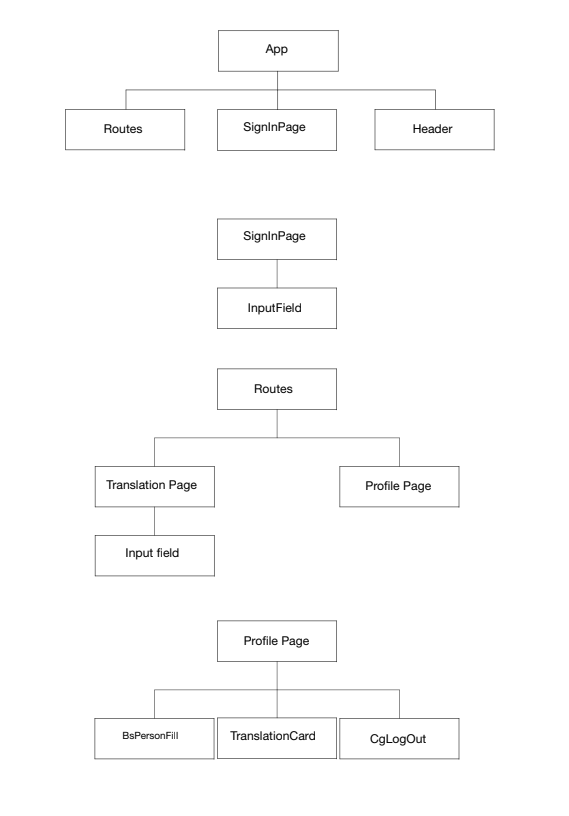

# Noroff Javascript Assignment 2 - Lost in Translation
The assignment is to build a front-end application with react for translating words into signlanguage. Also part of the assignment is using a JavaScript-API to persist users, and, their translation histories.

## Built with
 ### JavaScript and React
 The language used in the assignment is primarily Javascript, and the "framework" react. Additionally html and css has been used to form and decorate the page.
 
## Architecture
The components created in this application, are created based on if they are either re-used multiple times, or it makes logical sense to divide the code.

<p align="center">
  
</p>

The components createdin this application are:
<ul>
<li>App</li>
<li>SignInPage</li>
<li>TranslationPage</li>
<li>ProfilePage</li>
<li>Header</li>
<li>InputField</li>
<li>TranslationCard</li>
<li>CgLogOut</li>
<li>BsPersonFill</li>
</ul>

## Running
To run the project clone the git repo,add a .env file with the following variables set:
```sh
REACT_APP_API_URL
REACT_APP_API_KEY
```
and run:

```bash
  npm install
  npm start
  ```
 to install dependencies and start a development version of the application.
 
### Deployment
Clone the project to the deployment server with nginx installed, run
```bash
npm install
npm run buiild
```
to install dependencies, and build the project. Then point the nginx config to the build-folder of the project.
